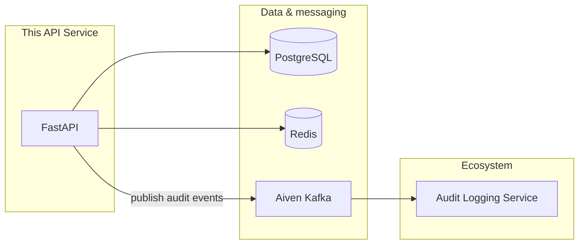
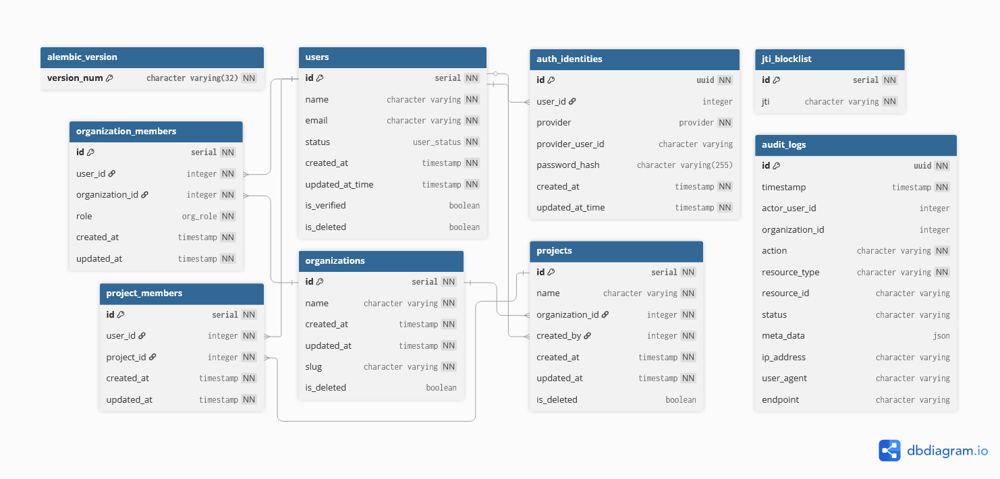

# Multi-Tenant Project Member Tracking SaaS

A microservices-ready, multi-tenant SaaS backend for **project member tracking**: organizations, projects, and role-based member management. Built with FastAPI, PostgreSQL, and event-driven audit via **Kafka**. Supports JWT auth, RBAC, and OAuth (Google).

**Live API:** [https://multi-tenant-saas-fastapi.onrender.com/docs](https://multi-tenant-saas-fastapi.onrender.com/docs) — currently hosted on Render, with an additional self-managed VPS deployment available at [http://65.108.80.81.nip.io/docs](http://65.108.80.81.nip.io/docs) behind NGINX and firewall.

---

## Table of contents

- [Architecture](#architecture)
- [Tech stack](#tech-stack)
- [Deployment](#deployment)
- [CI/CD](#cicd)
- [Testing](#testing)
- [Key features](#key-features)
- [Database schema](#database-schema)
- [Related repositories](#related-repositories)
- [API reference](#api-reference)
- [Getting started](#getting-started)
- [Contact](#contact)

---

## Architecture

High-level flow: this API service writes to PostgreSQL and publishes audit events to Aiven Kafka; a separate audit-logging service (see [Related repositories](#related-repositories)) consumes those events.



---

## Tech stack

| Category | Technologies |
|----------|--------------|
| **API** | [FastAPI](https://fastapi.tiangolo.com/), [Pydantic](https://docs.pydantic.dev/) (validation & serialization) |
| **Data** | [PostgreSQL](https://www.postgresql.org/) with [SQLAlchemy](https://www.sqlalchemy.org/), [Alembic](https://alembic.sqlalchemy.org/) (migrations) |
| **Message broker** | [Aiven Kafka](https://aiven.io/kafka) (SSL) |
| **Caching** | [Upstash](https://upstash.com/) (serverless Redis) |
| **Auth** | JWT (access/refresh token rotation), [Google OAuth 2.0](https://developers.google.com/identity/protocols/oauth2) |
| **Infra** | [Docker](https://www.docker.com/) & Docker Compose; DB on [Neon](https://neon.com/); API on Render and also deployed to a self-managed VPS behind NGINX with firewall protection |
| **Observability** | [Better Stack](https://betterstack.com/) (logs & uptime) |

---

## Deployment

- Public API currently available on Render at [multi-tenant-saas-fastapi.onrender.com/docs](https://multi-tenant-saas-fastapi.onrender.com/docs).
- A parallel self-managed VPS deployment is also maintained at [http://65.108.80.81.nip.io/docs](http://65.108.80.81.nip.io/docs) with NGINX and firewall protection.

---

## CI/CD

- `ci.yml` runs linting and unit tests on push to `main`/`dev` and on pull requests to `main`.
- `cd.yml` builds a Docker image, pushes it to GitHub Container Registry (GHCR), and SSHes into the VPS to pull and deploy the updated image via Docker Compose.
- The CI pipeline uses `uv` to install dependencies, run `ruff`, and execute `pytest` with test secrets supplied through GitHub Actions.

## Testing

- Unit tests are run with `uv run pytest -v`.
- Load and smoke tests are available in `k6/`; see `k6/README.md` for performance test instructions.
- Local test setup uses an in-memory SQLite database via `tests/conftest.py`.

---

## Key features

- **Project member tracking:** Organizations → projects → members with RBAC (owner, admin, member).
- **Multi-tenancy:** Full isolation between organizations.
- **Advanced auth:** JWT with token rotation; Google OAuth; optional password auth.
- **Event-driven audit:** Audit events published to Kafka for consumption by the [audit-logging service](#related-repositories).
- **Schema consistency:** Pydantic schemas for request/response validation and serialization.
- **Async:** Async APIs and DB access where applicable.

---

## Database schema

Core entities and relationships:

- **users** — User accounts; linked to organizations and projects via membership tables, and to **auth_identities** (password/Google).
- **organizations** — Tenants; have **organization_members** (user + role) and **projects**.
- **projects** — Belong to one organization, have **project_members** (user–project link). Unique project name per organization.
- **organization_members** — user_id → users, organization_id → organizations, role (owner/admin/member).
- **project_members** — user_id → users, project_id → projects; unique per (user, project).
- **auth_identities** — user_id → users; provider (password/google), provider_user_id, password_hash.
- **audit_logs** — Event records (actor_user_id, organization_id, action, resource_type, etc.); denormalized for audit.
- **jti_blocklist** — Revoked JWT IDs (logout/token rotation).

Below is the PostgreSQL schema (table relationships).



---

## Related repositories

| Repo | Description |
|------|-------------|
| **Audit logging** | Consumer service for audit events from Kafka. [https://github.com/abhishektarun09/multi_tenant_saas_fastapi_logging_microservice](https://github.com/abhishektarun09/multi_tenant_saas_fastapi_logging_microservice) |

---

## API reference

This service currently exposes version 2 routes under `/v2` for authentication, users, organizations, and projects. Health probes remain at `/health` and `/health/db`.

### Health & system

| Method | Endpoint | Description |
| :--- | :--- | :--- |
| `GET` | `/health` | Liveness check |
| `GET` | `/health/db` | Readiness probe for orchestration and DB status |

### Authentication

| Method | Endpoint | Description |
| :--- | :--- | :--- |
| `POST` | `/v2/auth/login` | Authenticate user & receive JWT pair |
| `POST` | `/v2/auth/logout` | Revoke tokens & end session |
| `POST` | `/v2/auth/refresh-token` | Exchange refresh token for a new pair |
| `GET` | `/v2/auth/google` | Redirects to the Google login page for OAuth |
| `GET` | `/v2/auth/callback/google` | Handles callback from Google after successful login |

### Users

| Method | Endpoint | Description |
| :--- | :--- | :--- |
| `POST` | `/v2/users/register` | Register a new user account |
| `GET` | `/v2/users/me` | Retrieve current user profile |
| `GET` | `/v2/users/orgs` | List organizations associated with the user |
| `PATCH` | `/v2/users/update-password` | Change current password |

### Organizations

| Method | Endpoint | Description |
| :--- | :--- | :--- |
| `POST` | `/v2/organizations/register` | Create a new organization |
| `PUT` | `/v2/organizations/update` | Update the organization details |
| `POST` | `/v2/organizations/select/{organization_id}` | Context-switch into a specific organization |
| `POST` | `/v2/organizations/member` | Invite/add users to an organization |
| `GET` | `/v2/organizations/users` | View all members of the active organization |
| `DELETE` | `/v2/organizations/` | Soft-delete the active organization (owner only) |
| `DELETE` | `/v2/organizations/member` | Remove a member from the organization (and from all its projects) |

### Projects

| Method | Endpoint | Description |
| :--- | :--- | :--- |
| `POST` | `/v2/projects/` | Create a project within the active organization |
| `POST` | `/v2/projects/{project_id}/member` | Add a user in the active organization to the project |
| `PUT` | `/v2/projects/{project_id}` | Update project in the active organization |
| `GET` | `/v2/projects/` | List all projects of the active organization |
| `GET` | `/v2/projects/{project_id}/members` | View all members of a project in the active organization |
| `DELETE` | `/v2/projects/{project_id}/member` | Remove a member from the project |
| `DELETE` | `/v2/projects/{project_id}` | Soft-delete the project from the organization |

---

## Getting started

### Prerequisites

- Docker & Docker Compose
- Python 3.12+ (for local development)

### Environment variables

Copy `.env.example` to `.env` and fill in values. Key variables:

- **Database:** `DATABASE_URL`
- **Auth:** `SECRET_KEY`, `ALGORITHM`, `ACCESS_TOKEN_EXPIRE_MINUTES`, `REFRESH_TOKEN_EXPIRE_DAYS`
- **Google OAuth:** `GOOGLE_CLIENT_ID`, `GOOGLE_CLIENT_SECRET`, `BASE_URL`
- **Aiven Kafka:** `aiven_kafka_bootstrap`, `aiven_kafka_topic`, `AIVEN_KAFKA_CA_PEM_B64`, `AIVEN_KAFKA_SERVICE_CERT_B64`, `AIVEN_KAFKA_SERVICE_KEY_B64`
- **Caching:** `REDIS_URL`
- **Logging:** `BETTER_STACK_TOKEN` (optional)

See [.env.example](.env.example) for the full list.

### Installation & setup

1. **Clone the repository:**
   ```bash
   git clone https://github.com/abhishektarun09/multi_tenant_saas_fastapi.git
   cd multi_tenant_saas_fastapi
   ```

2. **Create a `.env` file** in the project root using `.env.example`.

3. **Run with Docker:**
   ```bash
   docker-compose up --build
   ```

4. **Apply migrations:**
   ```bash
   docker-compose exec api sh -c "cd database && alembic upgrade head"
   ```

---

## Note

This project is under active development. New features and endpoints are added regularly.

---

## Contact

- **Author:** Abhishek Tarun
- **Email:** [abhishek.tarun09@gmail.com](mailto:abhishek.tarun09@gmail.com)
